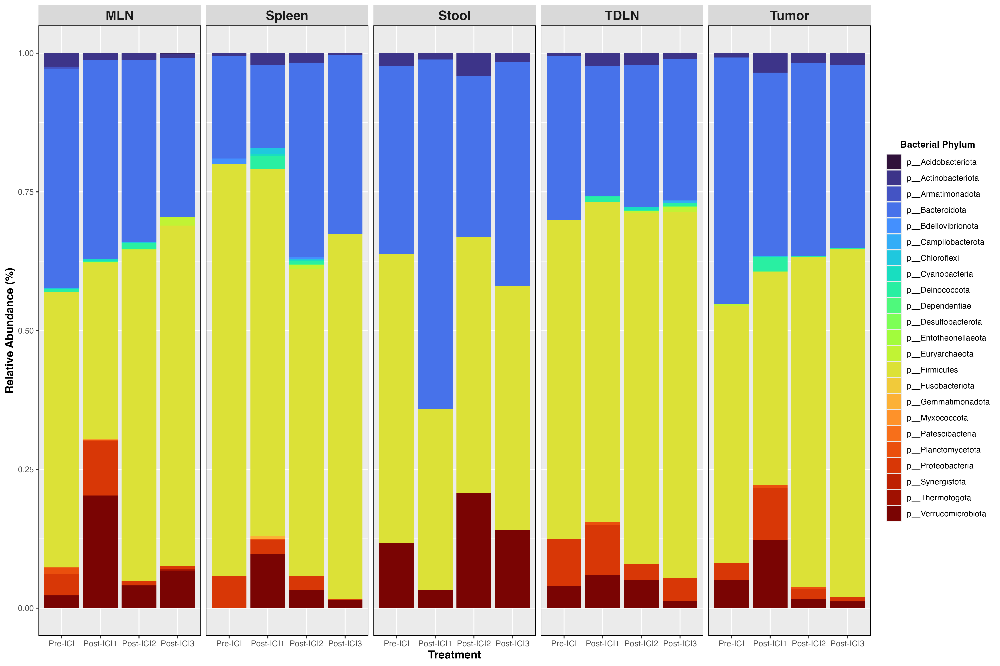
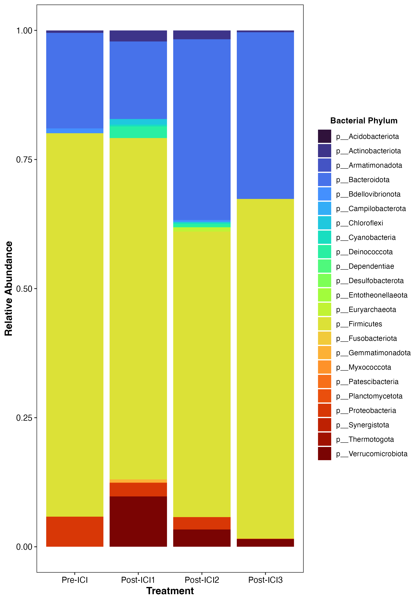
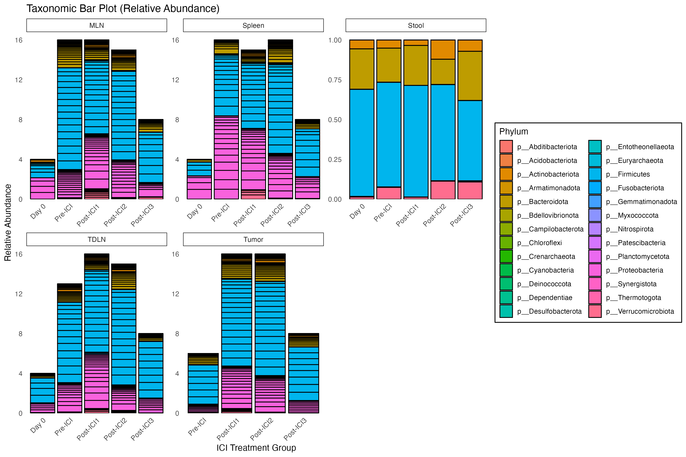
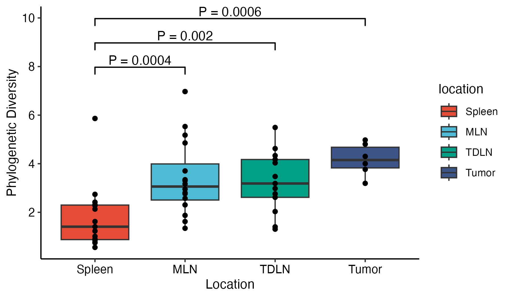
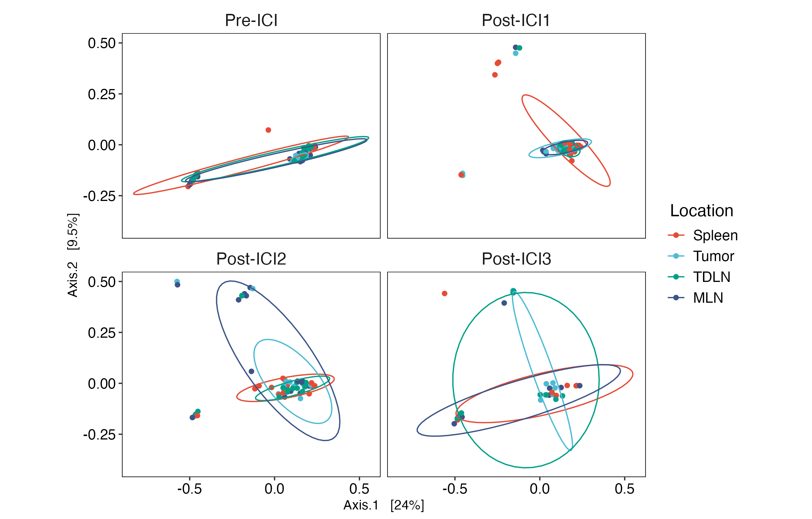
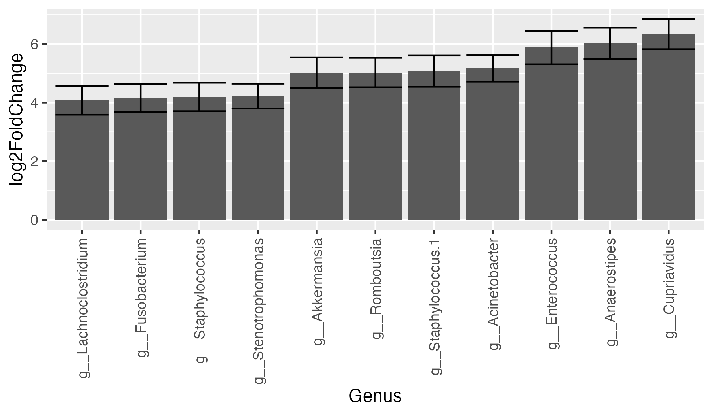
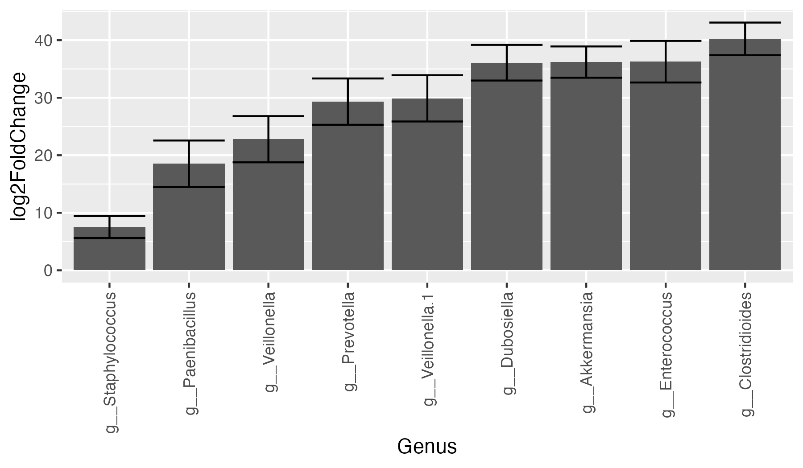

MICB475: Data Science Research in Microbiology
Team 2 - QingRu Kong, Pranjali Singh, Ran Tao, Tina Wang, Zurui Zhu

Mar 14th, 2025

## Agenda

- Attempted taxonomic bar plots, alpha diversity plots, beta diversity plots, core microbiome analysis, DEseq analysis

### Taxa Bar Plot: 

Include all locations 
> 

Spleen only (test)
> 

All locations using another code 
> 

### Alpha Diversity 
Using Faith PD
> 

### Beta Diversity
> 

### Core Microbiome 

Pre-ICI 
> 

Post-ICI3 
> 

### DEseq: 

all 
> 

spleen only 
> 

#### For next meeting:

## Meeting Minutes
