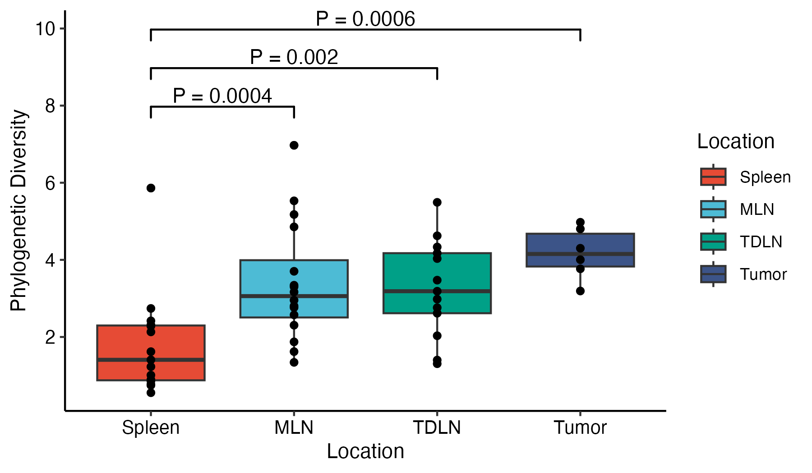
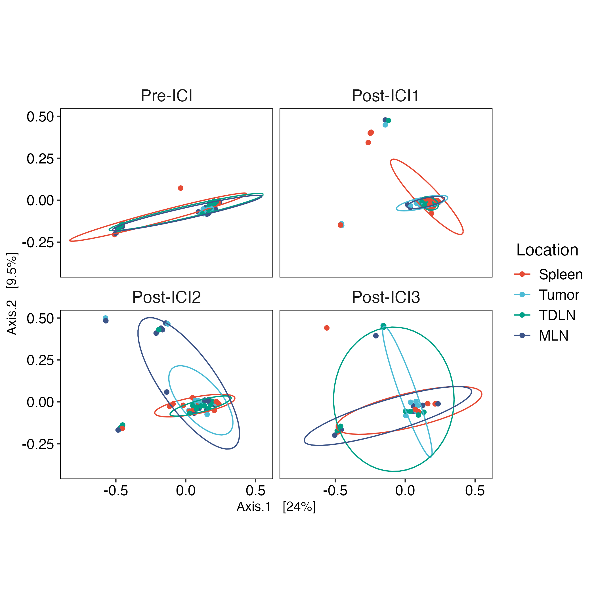

MICB475: Data Science Research in Microbiology
Team 2 - QingRu Kong, Pranjali Singh, Ran Tao, Tina Wang, Zurui Zhu

Mar 14th, 2025

## Agenda

- Attempted taxonomic bar plots, alpha diversity plots, beta diversity plots, core microbiome analysis, DEseq analysis

Taxa Bar Plot: all (left), spleen (middle), all using another code (right)
> 
> 
> 

Alpha Diversity
> 

Beta Diversity
> 

Core Microbiome for Pre-ICI (top) and Post-ICI3 (bottom)
> 
> 

DEseq: all (top), spleen only (bottom)
> 
> 

#### For next meeting:

## Meeting Minutes
